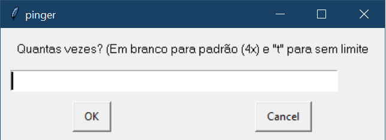
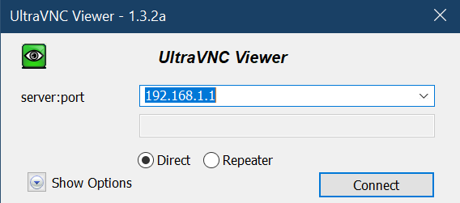
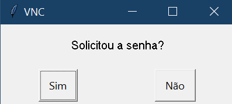

# Software Help Desk: Your Helper

#### O software Your Helper - Help Desk foi desenvolvido por mim, Danilo Dutra, para auxiliar o atendimento de Suporte Técnico 1º Nível na Assessória de Informática da SEC(Secretaria de Educação e Cidadania) da Prefeitura de São José dos Campos, SP.


#### Tela Principal do Software Your Helper


##### Icone utilizado para o Software Your Helper


# Funções encontradas no Your Helper:

### PROGRAMAS:

#### Lista Telefônica
```
  Utilizado para localizar números internos e externos
```
#### SME Logon
```
  Script para logon na rede interna
```
#### Active Directory
```
  Software utilizado para gerenciamento de segurança de recursos na rede
```
#### Opera
```
  Inicializa o navegador Opera (Deverá estar previamente instalado no Sistema Operacional)
```
#### Chrome
```
  Inicializa o navegador Chrome (Deverá estar previamente instalado no Sistema Operacional)
```
#### Seção Programas:


### UTILITÁRIOS E CONEXÃO REMOTA:

#### Bloco de Notas
```
  Atalho para o Bloco de Notas nativo do Sistema Operacional
```
#### Calculadora
```
  Atalho para a Calculadora nativa do Sistema Operacional
```
#### CMD (Prompt de Comando)
```
  Atalho para o Prompt de Comando do Windows
```
#### VNC
```
  Atalho para o executavel do Ultra VNC (O executável é instalado no diretório raiz do Software no momento da instalação do Your Helper)
```
#### Conexão Remota
```
  Atalho para a Conexão Remota do Windows
```
#### Assistencia Remota
```
  Atalho para a Assistencia Remota do Windows
```
#### Seção Utilitários:

  
### ATALHOS:

#### SOL
```
  Redireciona para a url do Sistema de Chamados SOL (Solicitações On-Line)
```
#### Infra
```
  Atalho para a url da planilha de Infraestrutura
```
#### Webmail
```
  Atalho para a url do Webmail
```
#### E-SEC
```
  Atalho para a url da página do E-SEC
```
#### Zabbix
```
  Atalho a url do Sistema Zabbix
```
#### Intranet
```
  Atalho para a Intranet da Prefeitura de São José dos Campos
```
#### Seção Atalhos:


### PASTAS ÚTEIS:

#### Programas
```
  Abre a pasta de rede contendo Softwares para instalação e utilização no dia a dia.
```
#### Impressoras
```
  Abre a pasta de instalação em rede das impressoras utilizadas no domínio
```
#### Procedimentos
```
  Abre a pasta contendo os procedimentos mais comuns utilizados pela Assessória de Informática 1º Nível
```
#### Seção Pastas Úteis:


### MÁQUINAS VIRTUAIS:

#### Máquinas Virtuais
```
  Redireciona para a pasta em rede contendo os atalhos paras máquinas virtuais utilizadas
```
#### Painel de Controle
```
  Atalho para Painel de Controle do Windows
  ```
#### Seção Máquinas Virtuais:


### PINGER


```
  Campo para inserção de IP ou nome da máquina no domínio. 
  Utilizado para teste de ping.
```
 1. Insira o número de IP ou nome da máquina no domínio e clique em "PINGAR". Clique em "Limpar" para limpar o IP ou nome da máquina.
 2. Posteriormente o programa perguntará quantas vezes deseja que o prompt faça o ping: OK para Padrão (4 vezes), "t" ou "T" para ping -t ou insira um número para a quantidade desejada 
 


### VNC


```
  Campo para inserção de IP ou nome da máquina no domínio. 
  Utilizado para conexão VNC.
```
 1. Insira o número de IP ou nome da máquina no domínio e clique em "Conectar". Clique em "Limpar" para limpar o IP ou nome da máquina.
 2. Posteriormente o programa irá abrir o executável do Ultra VNC e irá digitar automaticamente o IP ou número da máquina inserido no Campo anterior. 
 
 
 
 3. O Your Helper perguntará se a senha VNC foi solicitada.
 
 
 
 4. Caso a senha seja solicitada, clique em "Sim" para que o Your Helper preencha a senha de forma automática ou clique em "Não", caso não apareça a solicitação de senha pelo Ultra VNC.

### Serviço VNC


```
  Campo para inserção de IP ou nome da máquina no domínio. 
  Utilizado para INICIAR/PARAR VNC remotamente através de comando via prompt de comando de forma automática.
```
 1. Insira o número de IP ou nome da máquina no domínio e clique em "Conectar". Clique em "Limpar" para limpar o IP ou nome da máquina.
 2. Posteriormente o programa irá abrir o prompt de comando e digitará de forma automatizada a linha de comando junto ao IP ou nome da máquina no prompt de comando do Windows. 
